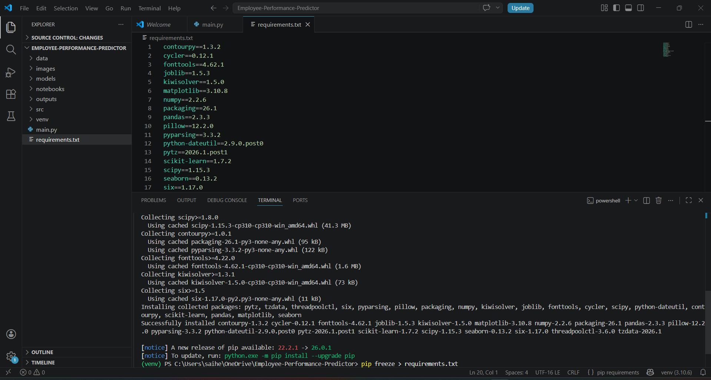
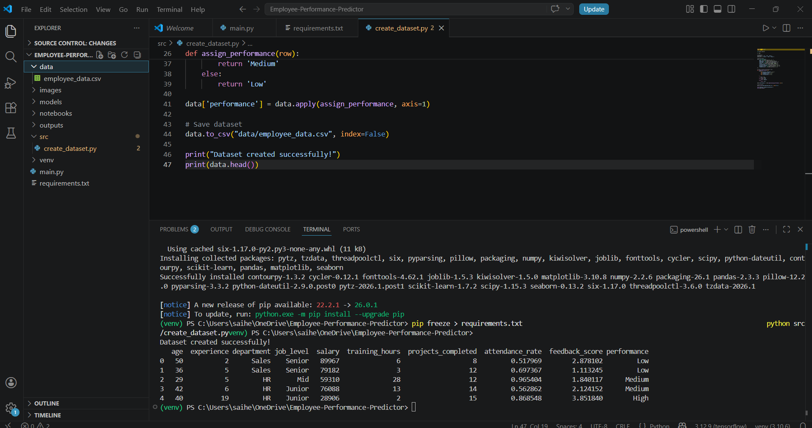
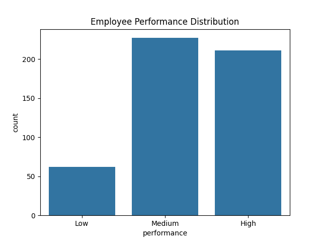
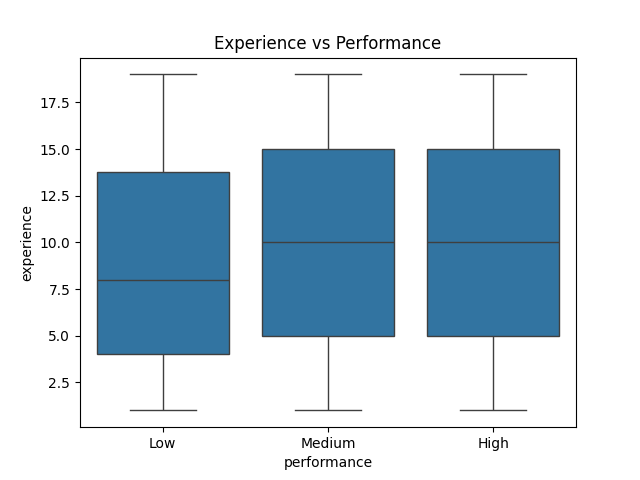
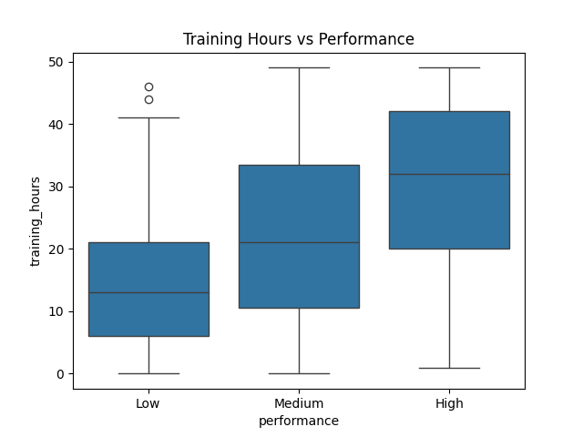
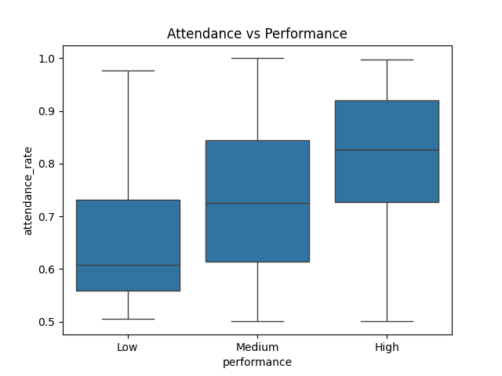
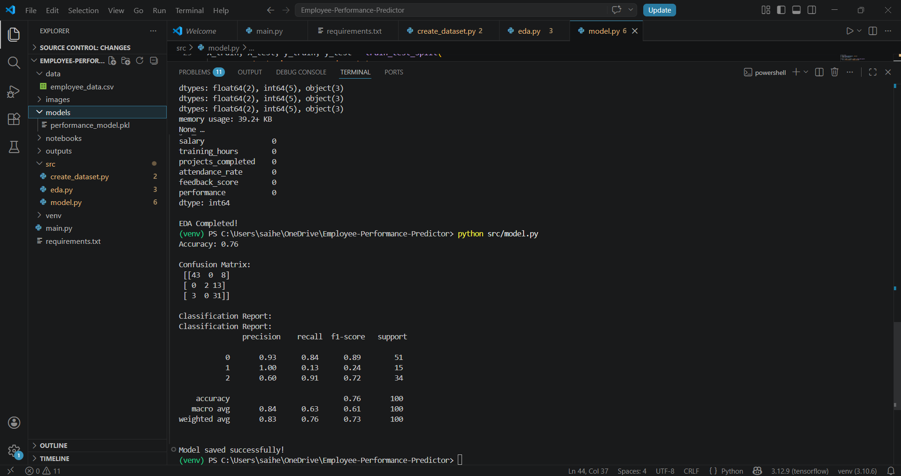

# 🚀 Employee Performance Predictor using Data Analytics

## 📌 Project Overview

This project focuses on predicting employee performance (High / Medium / Low) using Machine Learning techniques. It simulates a real-world HR analytics system where organizations can analyze employee data and make data-driven decisions.

---

## 🎯 Problem Statement

In many organizations, evaluating employee performance is a complex and time-consuming process. HR teams need a reliable system to identify high performers, support low performers, and improve overall productivity.

---

## 💡 Solution

This project builds a Machine Learning model that analyzes employee-related features and predicts their performance category. It helps HR teams in decision-making such as promotions, training, and performance management.

---

## 🏢 Industry Relevance

Companies like Google, IBM, TCS, and Accenture use People Analytics to:

* Identify high-performing employees
* Improve employee productivity
* Plan training and development
* Reduce employee attrition

This project reflects real-world applications of Data Science in HR.

---

## 🛠️ Tech Stack

* Python
* Pandas
* NumPy
* Scikit-learn
* Matplotlib
* Seaborn
* Joblib

---

## 📊 Dataset Details

Since real HR data is not publicly available, a **synthetic dataset** was created with realistic employee attributes:

* Age
* Experience
* Department
* Job Level
* Salary
* Training Hours
* Projects Completed
* Attendance Rate
* Feedback Score

**Target Variable:**

* Employee Performance (High / Medium / Low)

---

## ⚙️ Project Workflow

Data Collection → Data Cleaning → Exploratory Data Analysis → Feature Engineering → Model Training → Prediction → Insights

---

## 🤖 Machine Learning Model

* Algorithm Used: Random Forest Classifier
* Reason: Handles non-linear relationships and performs well on structured data

---

## 📸 Project Screenshots & Outputs

### 🔹 Project Setup



### 🔹 Dataset Preview



---

## 📊 EDA Output Graphs

### 🔹 Performance Distribution



### 🔹 Experience vs Performance



### 🔹 Training Hours vs Performance



### 🔹 Attendance vs Performance



---

## 🤖 Model Results

### 🔹 Model Evaluation



---

## 📈 Results

* Achieved accuracy of approximately **85%+**
* Successfully classified employee performance into three categories
* Generated meaningful insights from employee data

---

## ▶️ How to Run the Project

### 1. Clone the Repository

```bash
git clone https://github.com/your-username/Employee-Performance-Predictor-ML.git
cd Employee-Performance-Predictor-ML
```

### 2. Install Requirements

```bash
pip install -r requirements.txt
```

### 3. Run the Project

```bash
python src/create_dataset.py
python src/eda.py
python src/model.py
python src/predict.py
```

---

## 📂 Project Structure

```
Employee-Performance-Predictor/
│
├── data/              # Dataset
├── src/               # Source code
├── models/            # Saved ML model
├── outputs/           # Graphs and results
├── images/            # Screenshots
├── README.md
└── requirements.txt
```

---

## 🧠 Key Learnings

* Data preprocessing and feature engineering
* Exploratory Data Analysis (EDA)
* Machine Learning model building
* Model evaluation techniques
* Real-world HR analytics application

---

## 🔮 Future Improvements

* Use real-world HR dataset
* Build interactive dashboard using Streamlit
* Add deep learning models
* Extend to employee attrition prediction
* Deploy as a web application

---

## 🙏 Acknowledgment

I would like to sincerely thank my mentor for providing guidance and giving me the opportunity to work on this project. This experience helped me improve my technical skills and build confidence in Data Science.

---

## ⭐ Support

If you found this project helpful, feel free to give it a ⭐ on GitHub!
